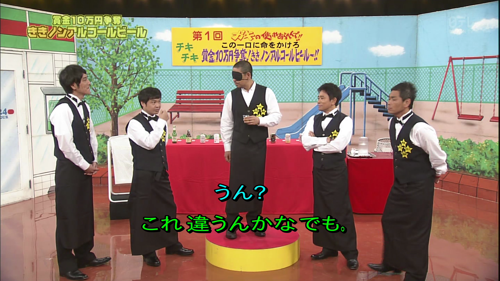
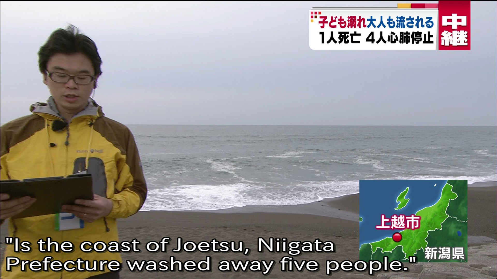

# arib

Japan Association of Radio Industries and Businesses (ARIB) MPEG2 Transport Stream Closed Caption Decoding Tools.

## Description
Closed Captions (CCs) are encoded in Japanese MPEG Transport Streams as a separate PES (Packetized Elementary Stream) within the TS. The format of the data within this PES is described by the (Japanese native) ARIB B-24 standard. An English document describing this standard is included in the Arib/docs directory in this repository.

This python package provides tools to find and parse this ARIB closed caption information in MPGEG TS files.

This code can be used in your own applications or used via the arib-ts2ass tool which this package provides.

The image below shows example ARIB closed caption data displayed at runtime on a media player, generated via arib-ts2ass. The text, position and color are all driven by data derived from the MPEG TS Closed Caption elemenatry stream.



# Installation
Basic installation is now supported, but I only currently recommend installing into a virtualenv as the lib is still only pre-alpha.

That said, installation can now be carried out via pip as below.
```
pip install -e git+https://github.com/johnoneil/arib#egg=arib
```
or install from a local git checkout
```
git clone https://github.com/johnoneil/arib.git
cd arib
pip install -e .
```
The above commands may require ```sudo``` though I recommend again installing them in a python virtualenv.

## arib-ts2ass

This package provides a tool (arib-ts2ass) that extracts ARIB based closed caption information from an MPEG Transport Stream recording, and formats the info into a standard .ass (Advanced Substation Alpha) subtitle file. The image below shows a resultant .ass subtitle file loaded to the video file it was generated off:

Note the ts2ass tool supports (in a basic way) closed caption locations, furigana (pronunciation guide), text size and color.

If no PID is specified to the tool, arib-ts2ass will attempt to find the PID of the elementary stream carriing Closed Caption information within the specified MPEG TS file. Or one can be specified if it is known (see below concerning how to find PID values in TS files).

Basic command line help is available as below.
```
usage: arib-ts2ass [-h] [-p PID] [-v] [-q] [-t TMAX] infile

Remove ARIB formatted Closed Caption information from an MPEG TS file and
format the results as a standard .ass subtitle file.

positional arguments:
  infile                Input filename (MPEG2 Transport Stream File)

optional arguments:
  -h, --help            show this help message and exit
  -p PID, --pid PID     Specify a PID of a PES known to contain closed caption
                        info (tool will attempt to find the proper PID if not
                        specified.).
  -v, --verbose         Verbose output.
  -q, --quiet           Does not write to stdout.
  -t TMAX, --tmax TMAX  Subtitle display time limit (seconds).
```
I've made some recent changes to this tool and its performance is much improved, even if the basic arib support is still lacking many parts of the spec. Scanning a several gigabyte .ts file for CC info should take less than a minute on a local drive.

# Experiments and Other Info

## arib-ts-extract
## arib-es-extract
This package also installs two additional tools which can be used to draw basic CC information from MPEG ts and es files. These are ```arib-ts-extract``` and ```arib-es-extract```. They skip the usual .ass formatting and show a text representation of the basic ARIB codes present in the .ts or .es file. See the example below:
```
joneil@joneilDesktop ~/code/arib $ arib-es-extract tests/toriko_subs.es

<CS:"620;480 V"><CS:"170;30 _"><CS:"1;0000 c"><clear screen>
<clear screen><CS:"620;480 V"><CS:"170;30 _"><CS:"1;0000 c"><clear screen>
<clear screen><CS:"620;480 V"><CS:"170;30 _"><CS:"1;0000 c">
<Screen Posiiton to 71,67>＜世はグルメ時代＞
<clear screen><CS:"620;480 V"><CS:"170;30 _"><CS:"1;0000 c">
<Screen Posiiton to 71,65>＜食の探求者<Medium Text> <Normal Text>美食屋たちは訢
<clear screen><CS:"620;480 V"><CS:"170;30 _"><CS:"1;0000 c">
<Screen Posiiton to 71,65>あまたの食材を追い求める＞
<clear screen><CS:"620;480 V"><CS:"170;30 _"><CS:"1;0000 c"><Small Text>
<Screen Posiiton to 76,66><Normal Text>＜そして<Medium Text> <Normal Text>この世の食材の頂点
<Screen Posiiton to 70,66><Small Text>ゴッド<Medium Text>
<Screen Posiiton to 70,75><Small Text>ほかく<Normal Text>
<Screen Posiiton to 71,65>ＧＯＤの捕獲を目指す訢
<clear screen><CS:"620;480 V"><CS:"170;30 _"><CS:"1;0000 c">
<Screen Posiiton to 71,66>一人の美食屋がいた！＞
<CS:"620;480 V"><CS:"170;30 _"><CS:"1;0000 c"><clear screen>
<clear screen><CS:"620;480 V"><CS:"170;30 _"><CS:"1;0000 c">
<Screen Posiiton to 71,64>頰〜
```

In the above output, each line is not timestamped, but you can see the cursor movement info (screen positions in character row/col) text size info, and the on screen CC text data.

Interestingly, you can see how the furigana for certain words (perl or kanji pronunciation guide) is present for many romaji (latin alphabet) and kanji characters. For example the furigana "ゴッド" is positioned as small text above the normal sized text word "ＧＯＤ".

Timestamp info for the for the various text and clear screen commands would have to be drawn out of the .TS packet info. This functionality is not present in this package.

Also note that in the example above, screen positions and other textual information was described using the ARIB control character set.
There is another way in which such info is carried around: via the ARIB control *seqence* character set. Please refer to the ARIB.control_characters.CS class for more info.

An example of inline control sequences carrying text position and other info follows:
```
<CS:"7 S"><CS:"170;30 _"><CS:"620;480 V"><CS:"36;36 W"><CS:"4 X"><CS:"24 Y"><Small Text><CS:"170;389 a">えいえゅゃ<Normal Text><CS:"170;449 a">栄純が<Medium Text><Small Text><CS:"530;449 a">い<Normal Text><CS:"190;509 a">きのぃとはゃなに言っくら訢
```
Refer to the ARIB documentation for descriptions of what these control sequences mean, but some can be summarized here:
* 'S' character indicates the text layout style according to the ARIB std (here 7 indicates horizontal text with geometry based on a screen of 960x540)
* '_' underscore indicates UL corner in pixels of CC area (here at x=170,y=30).
* 'V' indicates the width, height in pixels of the CC area (here 620x480). Note that this is inset inside a stanard screen dimension of 960x540.
* 'W' indicates the height and width of a normal sized character in pixels. Japanese characters tend to be square.
* 'X' is the pixel spacing between characters in CCs.
* 'Y' is the pixel spacing between lines in CCs.
* 'a' Positions the cursor to a screen position in pixels. This is in contrast to the dedicated control character APS (Active Position Set) above which positions the cursor to a particular character *line* and *column*. APS style line and column positions can be translated to pixel positions by using the character width and height, space between characters and lines and the UL position of the CC area (see above).

# Manually drawing a PID and/or PES from a TS file
I've update the arib-ts2ass tool above to automatically find the id (PID) of the elementary stream carrying closed captions (if there is one) in any MPEG TS file. However, if  you'd like to find these PID values for yourself I recommend using the ```tsinfo``` tool as below:
```
joneil@joneilDesktop ~/code/arib/analysis $ tsinfo <filename>.ts 
Reading from <filename>.ts
Scanning 1000 TS packets

Packet 452 is PAT
Program list:
    Program 2064 -> PID 0101 (257)

Packet 796 is PMT with PID 0101 (257)
  Program 2064, version 15, PCR PID 0100 (256)
     Program info (15 bytes): 09 04 00 05 e0 31 f6 04 00 0e e0 32 c1 01 84
     Conditional access: id 0005 (5) PID 0031 (49) data (9 bytes): f6 04 00 0e e0 32 c1 01 84
     Descriptor tag f6 (246) (4 bytes): 00 0e e0 32
     Descriptor tag c1 (193) (1 byte): 84
  Program streams:
    PID 0111 ( 273) -> Stream type 02 (  2) H.262/13818-2 video (MPEG-2) or 11172-2 constrained video
        ES info (6 bytes): 52 01 00 c8 01 47
        Descriptor tag 52 ( 82) (1 byte): 00
        Descriptor tag c8 (200) (1 byte): 47
    PID 0112 ( 274) -> Stream type 0f ( 15) 13818-7 Audio with ADTS transport syntax
        ES info (3 bytes): 52 01 10
        Descriptor tag 52 ( 82) (1 byte): 10
    PID 0114 ( 276) -> Stream type 06 (  6) H.222.0/13818-1 PES private data (maybe Dolby/AC-3 in DVB)
        ES info (8 bytes): 52 01 30 fd 03 00 08 3d
        Descriptor tag 52 ( 82) (1 byte): 30
        Descriptor tag fd (253) (3 bytes): 00 08 3d
    PID 0115 ( 277) -> Stream type 06 (  6) H.222.0/13818-1 PES private data (maybe Dolby/AC-3 in DVB)
        ES info (20 bytes): 52 01 38 09 04 00 05 ff ff f6 04 00 0e ff ff fd 03 00 08 3c
...
```
I recognize the PID 276, (stream type 6) as the PES private CC data from experience. Typically, tsinfo identifies Closed Caption elementary streams as `PES private data (maybe Dolby/AC-3 in DVB)`. The relevant CCs are usually the *first* elementary stream reported as well.

Note that sometimes an adequate PAT (Program allocation table) may not be within the first 1000 packets of the .TS, so you might have to run tsinfo with an additional argument (look through more packets for a PAT).
```
tsinfo -max 20000 <filename>.ts
```

Then, if you wish, you can use ts2es to draw out the ES.
```
ts2es -pid 276 <input>.ts <output>.es
```

## arib-autosub
This repo also contains some code for an experimental application "arib-autosub" which draws Closed Caption information out of an MPEG TS file and then translates it via Bing Translate.

As I'm no longer installing this tool when this package is installed the description below is only for reference:

Command line help is available as below:
```
(arib)joneil@joneilDesktop ~/code/arib $ arib-autosub -h
usage: arib-autosub [-h] infile pid

Auto translate jp CCs in MPEG TS file.

positional arguments:
  infile      Input filename (MPEG2 Transport Stream File)
  pid         Pid of closed caption ES to extract from stream.

optional arguments:
  -h, --help  show this help message and exit

```

The application requires 2 command line arguments, the name of the input .ts file and the PID of the CC elementary stream. Please see below regarding how to identify a Closed Caption PID in a .ts file using the tsinfo tool.

An example screenshot of a resultant subtitle follows (from a news broadcast):


Currently, text position and color are not carried through the translation process.

Because this tool uses the Bing Translate API, the user must get their own "Client ID" and "Client scret" credentials from the windows Azue Marketplace. These need be defined in the arib.secret_key module.

To find the PES ID of the closed captions stream within any TS (if it exists!) see the section below.

The translation results are not good. In fact, they are often lewd and comical. Still, this is an interesting experiment. To illustrate the defficiencies of the approach, I present the following screenshot, translating the shot from the previous section. You'll notice that despite the simplicity of the original source, the translation is off. It does give a "general sense" of meaning, however.


