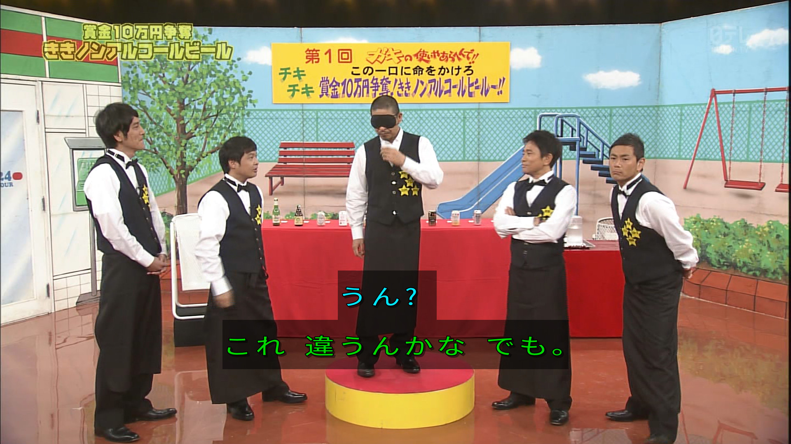
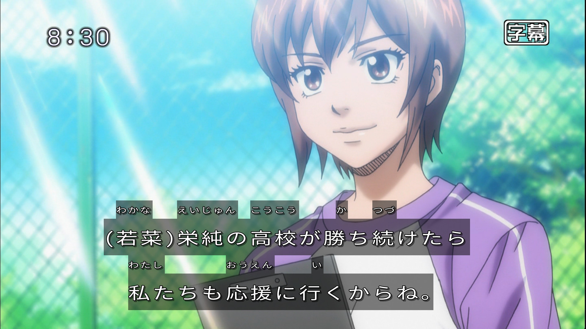
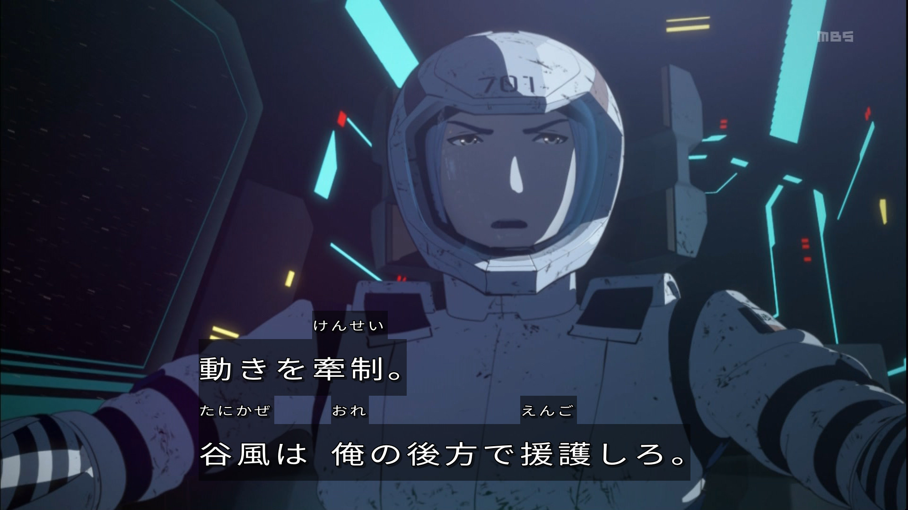
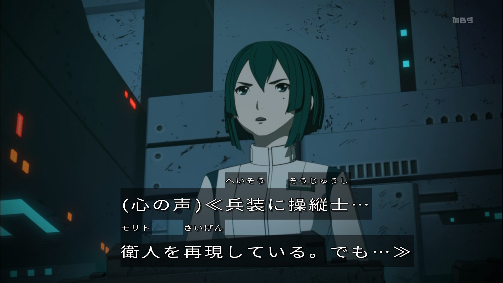
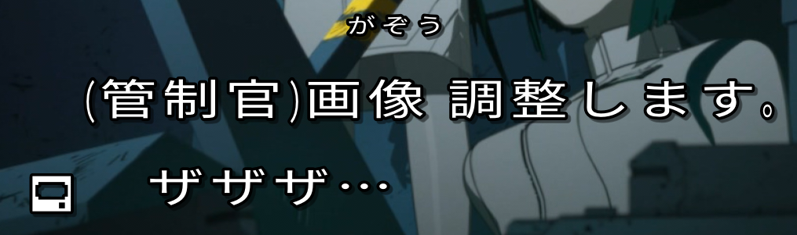
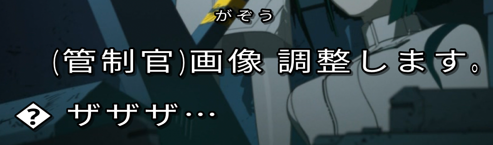

# arib

Japan Association of Radio Industries and Businesses (ARIB) MPEG2 Transport Stream Closed Caption Decoding Tools.

[](https://github.com/johnoneil/arib/actions/workflows/ci.yml)

<p>

</p>

# Description
Closed Captions (CCs) are encoded in Japanese MPEG Transport Streams as a separate PES (Packetized Elementary Stream) within the TS. The format of the data within this PES is described by the (Japanese native) ARIB B-24 standard. An English document describing this standard is included in the Arib/docs directory in this repository.

This python package provides tools to find and parse this ARIB closed caption information in MPGEG TS files and can be used in your own applications or used via the tools which this package provides.

# Installation

Installation should be typical. We recommend using virtual environment.

```
pip install git+https://github.com/johnoneil/arib
```

or install from a local git checkout

```
git clone https://github.com/johnoneil/arib.git
cd arib
pip install -e .
```

# Tools Provided

## `arib-ts2srt`

This package provides the `arib-ts2srt` tool which extracts closed caption data from a `.ts` file and produces a simple `.srt` file output. This application also serves as a simple example of how to use the underying library.

```
arib-ts2srt <input .ts file> [-o <optional output .srt file>]
```

An option exists to alternately output `.srt` data directly to stdout:

```
arib-ts2srt --stdou <input .ts. file> > output.srt
```

## `arib-ts2ass`

This tool outputs ARIB subtitle information in a formatted `.ass` ("advanced substation alpha") file. The advantage is that text position, color and size can be captured and presented as intended in the `.ts` stream. This is esecially advantageous in presenting furigana or ruby pronunciation guides correctly.



If no sutitle stream identifieer (PID) is provided to the tool, arib-ts2ass will attempt to find the PID of the elementary stream carriing Closed Caption information, or one can be specified if it is known (see below concerning how to find PID values in TS files).

### DRCS Support

This tool now has basic DRCS (dynamic runtime character) support, so when DRCS characters are encountered in the .ts stream they are cached and emitted as .ass drawing code when encountered in text. See the following image:



This behavior can be turned off if the .ass drawing code is too heavyweight by specifying the `--disable-drcs` command line option. This results in previous behavior whereby the "unknown character" glyph is emitted for DRCS (see below).



# Experiments and Other Info

See [here](./experiments.md)